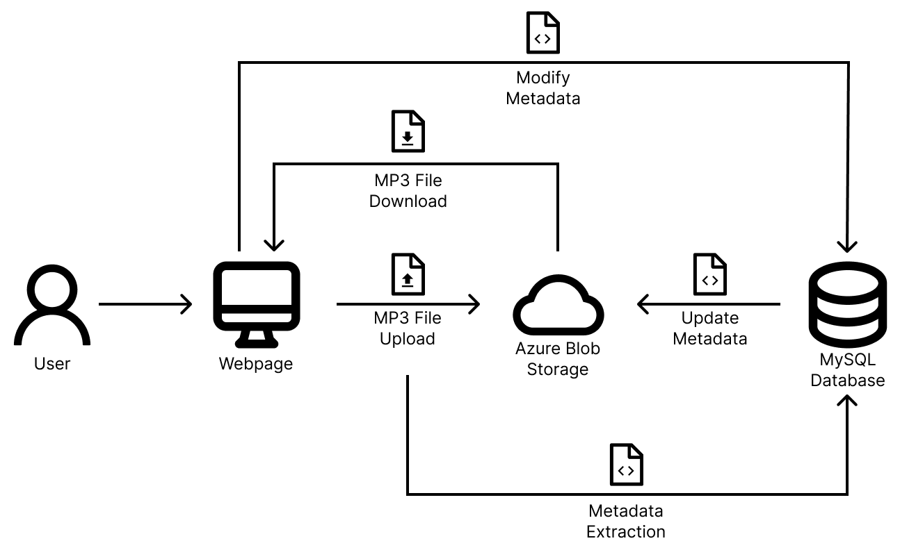

# **MP3 Metadata Design**

## **Introduction**

This document outlines the design for a web-based MP3 metadata editor, aiming for a user-friendly interface. The project utilizes modern UI principles to enhance the metadata editing experience.

## **Background**

This document outlines the design for a web-based MP3 metadata editor, aiming for a user-friendly interface. The project utilizes modern UI principles to enhance the metadata editing experience.

MP3 Metadata is a web-based editor that aims to provide users with a modern and seamless interface for uploading, editing, and downloading MP3 files. 

## **Requirements**

* Users can upload MP3 files
* Users can view and edit the metadata
* Users can view a list of their uploaded files
* Users can download all files in their file hub
* MP3 metadata website exhibits a superior aesthetic compared to competitors, showcasing an enhanced overall design and user experience

## **High-Level Design**

**Link – > [Design Document](https://www.figma.com/file/iEx2E5ykn8OX7cWus3EM0w/Chakra-UI-Figma-Kit-(Community)?type=design&node-id=2854-6513&mode=design&t=Sf5QVyzZObnOAzW9-0’)**

### **Next.js (API)**

Next.js API routes will be used for many backend functions. This includes routes to upload metadata to Azure Blob and MySQL, edit the metadata representation in MySQL, and integrate with the front end. 

### **React.js (Javascript Library)**

React will be used to build the user interface. This will allow for an interactive and dynamic website while providing many resources from the robust community surrounding React.

### **ChakraUI (React Component Library)**

ChakraUI will be used to customize UI components to create a modern and effective website. This will allow for greater control in the design and implementation of our website through Chakra's seamless integration with React.

### **Azure Blob (Cloud Storage)**

Azure Blob will be used to store MP3 files that are uploaded by the user. This is a scalable, secure, and cost-effective way to store MP3 files.

### **MySQL (Relational Database)**

MySQL will be used to store the MP3 metadata representation of the files. This is also where the edited metadata will be stored before the user downloads. This will allow us to store our metadata in a systematic way allowing for fast search and query of metadata.

### **Prisma (ORM Library)**

Prisma will be used to make interacting with MySQL easier.  Prisma will generate type-safe queries and its data modeling capabilities simplify database interactions, ensuring efficient access to MySQL.

## **Detailed Design**

### **User Verification**

To ensure the files uploaded by a certain user are safe, we are using a unique session ID for each user who logs in. 

Our application will use industry-standard UUIDs. (Universal Unique Identifiers) 

UUIDs are 128-bit length sequences that are generated randomly. Additionally, an underlying system is in place to prevent already unlikely collisions, even in large distributed systems.

### **File Upload**

To enable MP3/MPEG file uploads, we require a storage solution accommodating moderately large files. Azure Blob, supporting built-in metadata functions, allows the upload of larger files as blobs. When users upload files, metadata is extracted to MySQL, and the file is stored in Azure Blob.

### **Storing Metadata/Returning Files**

To approve the efficiency of updating metadata, we are using a MySQL database. After files are uploaded to Azure Blob, the metadata is extracted. Every time a user wants to view or modify the metadata, a query will be made to the MySQL database instead of Azure Blob. 

When a user wants to download updated audio files, the application will first update the metadata in the MySQL database and then apply those changes to the audio file in Azure Blob. After this, the application can download the file from Azure Blob’s storage.

## **Limitations & Future Work**

* Standard file size limits may restrict user capabilities. 
* Editing large MP3s ("Movie Length") is not supported.
* Database overload is possible with rapid uploads.
* Working with different file types(i.e. WAV files)

## **References**

**[Design Doc Ideas](https://neetcode.io/courses/lessons/design-youtube)**

**[Diagram Design outline](https://neetcode.io/courses/full-stack-dev/21)**
